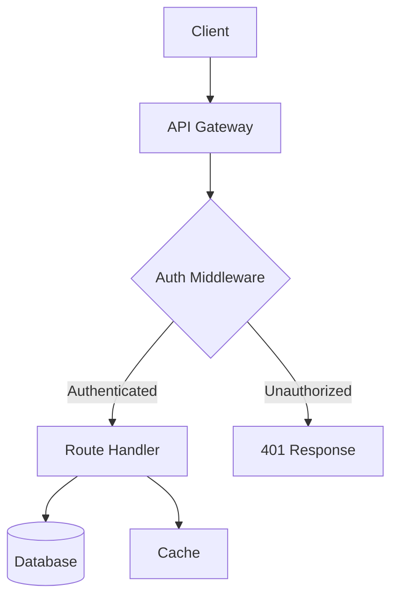
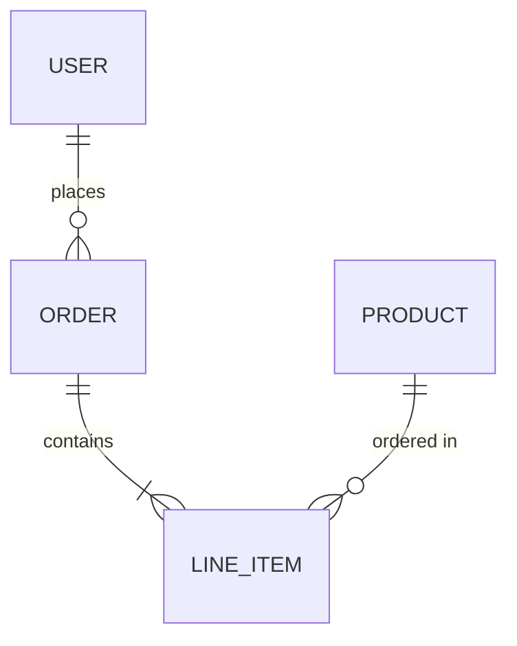
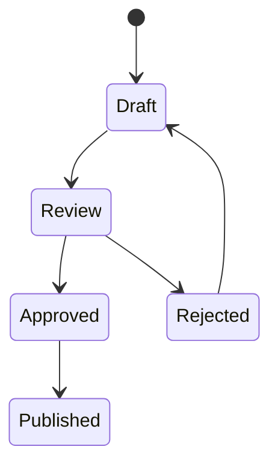

# SPEC.md Format Reference (TDD)

This is the complete format specification for TDD-first spec documents. Use
this as the template when creating new specs. Every spec follows a strict
test-before-implementation structure: write tests first, then implement to
satisfy them.

## Full Template

```markdown
---
id: <spec-id>
title: <Human Readable Title>
status: active | paused | completed | archived
created: <YYYY-MM-DD>
updated: <YYYY-MM-DD>
priority: high | medium | low
tags: [<tag1>, <tag2>]
---

# <Title>

## Overview

<2-4 sentences describing what this spec accomplishes and why. Include
enough context that someone resuming cold can understand the goal without
reading the full conversation history.>

## Requirements

- <When X happens, the system shall Y>
- <The Z component shall do W>
- [NEEDS CLARIFICATION] <Ambiguous requirement that needs discussion>

Requirements are lightweight acceptance criteria — what "done" looks like.
Not every spec needs them (skip for small bug fixes), but for features
they prevent scope creep and make verification clear.

## Architecture

<Include at least one diagram showing the system design. Use ASCII art for
simple flows and Mermaid for complex relationships.>

### System Diagram

```
Client --> API Gateway --> Auth Middleware --> Route Handler --> Database
                                                 |
                                            Cache Layer
```

<Or use Mermaid for more complex diagrams:>



<For data models, use ER diagrams:>



<For state machines and workflows:>



## Testing Architecture

### Test Framework & Tools

| Tool | Choice | Version | Purpose |
|------|--------|---------|---------|
| Test framework | <Vitest/Jest/pytest/JUnit 5/etc.> | <ver> | Unit and integration test runner |
| Mocking library | <MSW/vi.mock/pytest-mock/Mockito/etc.> | <ver> | Dependency isolation |
| DB testing | <Testcontainers/test DB/etc.> | <ver> | Real database integration tests |
| HTTP mocking | <MSW/WireMock/VCR/etc.> | <ver> | External API isolation |
| Coverage tool | <v8/istanbul/coverage.py/JaCoCo/etc.> | <ver> | Code coverage reporting |
| Mutation testing | <Stryker/Pitest/mutmut/etc.> | <ver> | Test quality verification |
| E2E framework | <Playwright/Cypress/etc.> | <ver> | End-to-end user flows |

### Isolation Strategy

| Layer | Isolation Approach | Services |
|-------|--------------------|----------|
| Domain / Business logic | No mocks; pure functions | None |
| Service / Use cases | Mock ports (interfaces) | <list injected deps> |
| Repository / Data access | Testcontainers | <PostgreSQL/Redis/etc.> |
| HTTP clients | MSW / WireMock | <list external APIs> |
| API handlers | Supertest / httptest | Full handler stack |
| E2E | Full stack | All services running |

### Coverage Targets

| Metric | Target | Notes |
|--------|--------|-------|
| Line coverage | <XX%> | Measured by <tool> |
| Branch coverage | <XX%> | Measured by <tool> |
| Mutation score | <XX%> | Measured by <tool>; focus on critical paths |

### Test Commands

| Command | Purpose |
|---------|---------|
| `<npm test / pytest / go test>` | Run all unit tests |
| `<npm run test:integration>` | Run integration tests |
| `<npm run test:coverage>` | Generate coverage report |
| `<npm run test:mutation>` | Run mutation testing |
| `<npm run test:e2e>` | Run end-to-end tests |

### Anti-Patterns to Avoid

- <List specific anti-patterns relevant to this project's stack>
- <e.g., No SQLite as PostgreSQL stand-in; use Testcontainers>
- <e.g., No mocking internal modules; mock at port boundaries>
- <e.g., No sleep-based waits; use polling assertions>

## Library Choices

| Need | Library | Version | Alternatives Considered | Rationale |
|------|---------|---------|------------------------|-----------|
| <need> | <chosen> | <ver> | <alt1>, <alt2> | <why this one> |

## Phase 1: Tests for <Feature A> [in-progress] (TEST)

- [x] [TEST-XX-01] <Write tests for component/function Y>
- [ ] [TEST-XX-02] <Write tests for edge case Z> <- current
- [ ] [TEST-XX-03] <Write integration tests for flow W>

## Phase 2: Implement <Feature A> [pending] (IMPL)

- [ ] [IMPL-XX-04] <Implement Y> -> satisfies [TEST-XX-01]
- [ ] [IMPL-XX-05] <Handle edge case Z> -> satisfies [TEST-XX-02]
- [ ] [IMPL-XX-06] <Wire up integration flow W> -> satisfies [TEST-XX-03]

## Phase 3: Tests for <Feature B> [pending] (TEST)

- [ ] [TEST-XX-07] <Write tests for ...>
- [ ] [TEST-XX-08] <Write tests for ...>

## Phase 4: Implement <Feature B> [pending] (IMPL)

- [ ] [IMPL-XX-09] <Implement ...> -> satisfies [TEST-XX-07]
- [ ] [IMPL-XX-10] <Implement ...> -> satisfies [TEST-XX-08]

---

## Resume Context

> <Detailed description of where you left off. Include:>
> - What was just completed
> - What's currently in progress
> - TDD Phase: RED | GREEN | REFACTOR
> - Failing Tests: <list of currently failing test names, or "none">
> - Last Test Run: `<exact command>` at <time>, <pass/fail count>
> - Specific file paths and function/component names
> - The exact next step to take
> - Any blockers or open questions
>
> Write this as if briefing a colleague picking up your work tomorrow.

## Decision Log

| Date | Decision | Rationale |
|------|----------|-----------|
| <YYYY-MM-DD> | <What was decided> | <Why this choice was made> |

## TDD Log

| Task | Red (Failure Output) | Green (Pass Output) | Refactor (Changes) |
|------|---------------------|--------------------|--------------------|
| [TEST-XX-01] | `Expected: 201, Received: undefined` | `3 passed, 0 failed` | Extracted validation to `validateInput()` |
| [IMPL-XX-04] | N/A (impl task) | `3 passed, 0 failed` | N/A |

## Deviations

| Task | Spec Said | Actually Did | Why |
|------|-----------|-------------|-----|
| <Task name> | <What was planned> | <What was implemented> | <Reason for the change> |
```

## Field Definitions

### Frontmatter Fields

| Field | Required | Description |
|-------|----------|-------------|
| `id` | Yes | URL-safe identifier, lowercase hyphenated (e.g., `user-auth-system`) |
| `title` | Yes | Human-readable name |
| `status` | Yes | One of: `active`, `paused`, `completed`, `archived` |
| `created` | Yes | ISO date when spec was created |
| `updated` | Yes | ISO date of last modification |
| `priority` | No | `high`, `medium`, or `low` (default: medium) |
| `tags` | No | YAML array of categorization tags |

### Phase Status Markers

Phase headings include a status marker in square brackets:

| Marker | Meaning |
|--------|---------|
| `[pending]` | Not started yet |
| `[in-progress]` | Currently being worked on |
| `[completed]` | All tasks done |
| `[blocked]` | Waiting on something external |

Only **one phase** should be `[in-progress]` at a time (though this isn't
strictly enforced — sometimes parallel phases make sense).

### Phase Types (TDD)

Every phase is tagged with a type suffix:

| Suffix | Meaning |
|--------|---------|
| `(TEST)` | Write failing tests first — no production code |
| `(IMPL)` | Write production code to make tests pass, then refactor |

TEST phases always precede their corresponding IMPL phases. A feature's
tests must be written and committed before its implementation begins.

### Task Format (TDD)

Tasks use markdown checkboxes with a typed task code prefix:

```markdown
- [ ] [TEST-XX-01] Write tests for user creation (TEST phase task)
- [ ] [IMPL-XX-02] Implement user creation -> satisfies [TEST-XX-01] (IMPL phase task)
- [ ] [TEST-XX-03] Current test task <- current
```

**Task codes** use the format `<TYPE>-<PREFIX>-<NN>`:

- **Type**: `TEST` for test-writing tasks, `IMPL` for implementation tasks.
- **Prefix**: A short (2-4 letter) uppercase abbreviation of the spec.
  Pick the most recognizable word or use initials:
  - `user-auth-system` -> `AUTH`
  - `api-refactor` -> `API`
  - `fix-upload-bug` -> `UPL`
- **Number**: Two-digit, auto-incrementing across ALL phases (not per-phase).
  Start at `01`. Continuous numbering across TEST and IMPL phases.

IMPL tasks include a `-> satisfies [TEST-XX-NN]` reference linking back to
the test task they satisfy. This creates traceability between tests and
implementation.

The `<- current` marker indicates which task the AI should work on next.
Only one task should have this marker at a time.

**Task granularity**: Each task should represent roughly one focused work
session (30 min to 2 hours of work). If a task feels like it would take a
full day, break it into subtasks.

### Uncertainty Markers

Use `[NEEDS CLARIFICATION]` for any requirement or task where ambiguity
remains after interviews:

```markdown
- [ ] [TEST-AUTH-05] [NEEDS CLARIFICATION] Write tests for rate limiting behavior
```

These markers signal that the task needs more discussion before
implementation. Don't start a task with this marker — resolve it first
(run another interview round or ask the user directly).

### Testing Architecture

The Testing Architecture section is placed after Architecture and before
Library Choices. It documents the full testing stack and strategy:

1. **Test Framework & Tools** — Table of every testing tool with version
   and purpose. Covers runners, mocking, DB testing, HTTP mocking, coverage,
   mutation testing, and E2E.
2. **Isolation Strategy** — Table mapping each architectural layer to its
   isolation approach and the services it interacts with.
3. **Coverage Targets** — Line coverage, branch coverage, and mutation
   score targets with measuring tools.
4. **Test Commands** — Exact CLI commands for running each test category.
5. **Anti-Patterns to Avoid** — Project-specific anti-patterns based on
   the stack (reference `testing-knowledge.md` for the full catalog).

### Resume Context (TDD)

The Resume Context section is freeform markdown inside a blockquote. It
should answer these questions:

1. **What just happened?** — What was completed in the last session
2. **What's the current state?** — Which files changed, what works, what doesn't
3. **TDD Phase** — Are you in RED (writing failing tests), GREEN (making
   tests pass), or REFACTOR (cleaning up while tests stay green)?
4. **Failing Tests** — List currently failing test names with brief failure reasons
5. **Last Test Run** — Exact command, timestamp, pass/fail count
6. **What's next?** — The specific next action to take
7. **Where exactly?** — File paths, function names, line ranges
8. **Any gotchas?** — Blockers, open questions, things that didn't work

**Good example:**
```markdown
> Finished writing tests for the JWT refresh endpoint in
> `tests/unit/auth/refresh.test.ts`. Three tests written: valid refresh,
> expired token, and rotated token reuse detection. All three fail as
> expected (RED phase).
>
> TDD Phase: RED
> Failing Tests:
>   - `should return new access token for valid refresh token` — 404 (route not implemented)
>   - `should reject expired refresh tokens` — 404
>   - `should reject reused refresh tokens` — 404
> Last Test Run: `npm test -- --grep refresh` at 14:32, 0 passed / 3 failed
>
> Next step: Move to IMPL phase — implement `POST /auth/refresh` handler
> in `src/routes/auth.ts` to make the first test pass. Start with the
> happy path (valid refresh -> new access token).
>
> Key file: `src/auth/tokens.ts` (needs `rotateRefreshToken()` function)
> Key file: `src/routes/auth.ts` (needs the POST handler, line ~45)
```

**Bad example:**
```markdown
> Was working on authentication tests. Made some progress.
```

### Decision Log

Track non-obvious technical decisions so you (or another AI session) can
understand why things are the way they are:

```markdown
| Date | Decision | Rationale |
|------|----------|-----------|
| 2026-02-10 | Vitest over Jest | Faster execution, native ESM, same project uses Vite |
| 2026-02-10 | Testcontainers over test DB | Hermetic tests; no shared state between CI runs |
| 2026-02-11 | MSW over nock | MSW intercepts at network level; works in browser and Node |
```

Good decisions to log:
- Library/framework choices (especially testing tools)
- Architecture patterns
- Testing strategy decisions (isolation boundaries, what to mock)
- API design decisions
- Trade-offs made (speed vs fidelity, coverage vs maintenance)
- Things you tried and rejected (and why)

### TDD Log

Track the red-green-refactor cycle for each task. This creates an audit
trail showing that TDD discipline was followed:

```markdown
| Task | Red (Failure Output) | Green (Pass Output) | Refactor (Changes) |
|------|---------------------|--------------------|--------------------|
| [TEST-AUTH-01] | `Expected: 201, Received: undefined` | `3 passed, 0 failed` | Extracted shared fixtures to `test/helpers/auth.ts` |
| [IMPL-AUTH-02] | N/A (impl task) | `3 passed, 0 failed` | Renamed `createToken` -> `issueAccessToken` for clarity |
```

- **TEST tasks**: Record the RED output (expected failure), then GREEN after
  the corresponding IMPL task passes them.
- **IMPL tasks**: Record GREEN (tests passing) and any REFACTOR changes.
- Keep entries concise — one line per task.

### Deviations

Track cases where implementation diverged from the original spec. This
happens when errors are found, assumptions prove wrong, or a better
approach is discovered during coding:

```markdown
| Task | Spec Said | Actually Did | Why |
|------|-----------|-------------|-----|
| Token refresh | In-memory token store | Redis token store via Testcontainers | Needed TTL support for token expiry |
| Rate limiting | Custom middleware | express-rate-limit + Redis store | Battle-tested; no point reimplementing |
```

Good deviations to log:
- Tasks where the approach changed during implementation
- API signatures that differ from what was planned
- Libraries swapped for alternatives
- Tasks skipped because they turned out unnecessary
- Extra tasks added to handle discovered edge cases
- Test strategy changes (e.g., switched from mocking to integration)

**Don't log minor adjustments** (renamed a variable, reordered parameters).
Only log changes that would surprise someone reading the spec and comparing
it to the code.

## Minimal Spec Example (TDD)

For small tasks, a spec can be much simpler but still follows test-first:

```markdown
---
id: fix-upload-bug
title: Fix File Upload Bug
status: active
created: 2026-02-10
updated: 2026-02-10
priority: high
---

# Fix File Upload Bug

## Overview

Files over 10MB fail silently on upload. The multipart parser truncates
the stream. Need to fix the size limit and add proper error handling.

## Testing Architecture

### Test Framework & Tools

| Tool | Choice | Version | Purpose |
|------|--------|---------|---------|
| Test framework | Vitest | 3.0.4 | Unit and integration test runner |
| HTTP testing | Supertest | 7.1.0 | HTTP assertion library |

### Test Commands

| Command | Purpose |
|---------|---------|
| `npx vitest run` | Run all unit tests |
| `npx vitest run tests/integration` | Run integration tests |

## Phase 1: Tests for Upload Fix [in-progress] (TEST)

- [x] [TEST-UPL-01] Write test reproducing the bug with a 15MB file
- [ ] [TEST-UPL-02] Write boundary tests (exactly 10MB, 10.1MB, 100MB) <- current
- [ ] [TEST-UPL-03] Write test for proper error response on oversized files

## Phase 2: Implement Upload Fix [pending] (IMPL)

- [ ] [IMPL-UPL-04] Fix multipart parser size limit in `src/upload/parser.ts` -> satisfies [TEST-UPL-01]
- [ ] [IMPL-UPL-05] Add proper error response for oversized files -> satisfies [TEST-UPL-02], [TEST-UPL-03]

---

## Resume Context

> Phase 1 in progress. Wrote the reproduction test in
> `tests/integration/upload.test.ts` — it fails with a timeout as expected
> (the stream hangs instead of erroring).
>
> TDD Phase: RED
> Failing Tests:
>   - `should reject files over 10MB with 413 status` — timeout after 5s
> Last Test Run: `npx vitest run tests/integration/upload.test.ts` at 10:15, 0 passed / 1 failed
>
> Next step: Write boundary condition tests for exactly 10MB, 10.1MB, and
> 100MB file sizes. The upload handler is in `src/upload/parser.ts` and uses
> `busboy` for multipart parsing. Suspect `limits.fileSize` is set too low.

## TDD Log

| Task | Red (Failure Output) | Green (Pass Output) | Refactor (Changes) |
|------|---------------------|--------------------|--------------------|
| [TEST-UPL-01] | `Timeout: test exceeded 5000ms` | Pending (IMPL phase) | — |
```

## Complex Spec Example (TDD)

For larger features with multiple test/implement phase pairs:

```markdown
---
id: real-time-collab
title: Real-Time Collaboration
status: active
created: 2026-02-01
updated: 2026-02-10
priority: high
tags: [feature, websocket, collaboration]
---

# Real-Time Collaboration

## Overview

Add real-time collaborative editing to the document editor. Multiple
users should see each other's cursors and edits in real time, with
conflict resolution handled via CRDTs.

## Testing Architecture

### Test Framework & Tools

| Tool | Choice | Version | Purpose |
|------|--------|---------|---------|
| Test framework | Vitest | 3.0.4 | Unit and integration tests |
| WebSocket testing | Socket.io-client | 4.8.0 | WS client for integration tests |
| Mocking | MSW | 2.7.0 | HTTP mocking for auth endpoints |
| Coverage | v8 (Vitest) | built-in | Line and branch coverage |
| E2E | Playwright | 1.50.0 | Multi-browser collaboration tests |

### Isolation Strategy

| Layer | Isolation Approach | Services |
|-------|--------------------|----------|
| CRDT logic | No mocks; pure Yjs operations | None |
| WS connection manager | Mock Socket.io server | Socket.io |
| Auth middleware | Mock JWT verification | Auth service |
| E2E | Full stack | WS server, auth, database |

### Coverage Targets

| Metric | Target | Notes |
|--------|--------|-------|
| Line coverage | 85% | Focus on CRDT and WS layers |
| Branch coverage | 75% | Especially error/reconnection paths |
| Mutation score | 70% | Critical paths: merge conflict, auth |

### Test Commands

| Command | Purpose |
|---------|---------|
| `npx vitest run` | Run all unit tests |
| `npx vitest run tests/integration` | Run integration tests |
| `npx vitest --coverage` | Generate coverage report |
| `npx playwright test` | Run E2E collaboration tests |

## Phase 1: Tests for WebSocket Infrastructure [completed] (TEST)

- [x] [TEST-RTC-01] Write tests for WS server connection lifecycle
- [x] [TEST-RTC-02] Write tests for room-based connections (join, leave, broadcast)
- [x] [TEST-RTC-03] Write tests for WS auth middleware (valid JWT, expired, missing)
- [x] [TEST-RTC-04] Write tests for reconnection and state recovery

## Phase 2: Implement WebSocket Infrastructure [completed] (IMPL)

- [x] [IMPL-RTC-05] Set up WebSocket server with Socket.io -> satisfies [TEST-RTC-01]
- [x] [IMPL-RTC-06] Implement room-based connections -> satisfies [TEST-RTC-02]
- [x] [IMPL-RTC-07] Add authentication middleware for WS -> satisfies [TEST-RTC-03]
- [x] [IMPL-RTC-08] Handle reconnection and connection state -> satisfies [TEST-RTC-04]

## Phase 3: Tests for CRDT Integration [in-progress] (TEST)

- [x] [TEST-RTC-09] Write tests for Yjs document sync between two clients
- [x] [TEST-RTC-10] Write tests for document sync provider initialization
- [ ] [TEST-RTC-11] Write tests for awareness protocol (cursors, selections) <- current
- [ ] [TEST-RTC-12] Write tests for undo/redo with CRDT state

## Phase 4: Implement CRDT Integration [pending] (IMPL)

- [ ] [IMPL-RTC-13] Integrate Yjs as CRDT library -> satisfies [TEST-RTC-09]
- [ ] [IMPL-RTC-14] Create document sync provider -> satisfies [TEST-RTC-10]
- [ ] [IMPL-RTC-15] Implement awareness protocol -> satisfies [TEST-RTC-11]
- [ ] [IMPL-RTC-16] Add undo/redo manager -> satisfies [TEST-RTC-12]

## Phase 5: Tests for UI Layer [pending] (TEST)

- [ ] [TEST-RTC-17] Write tests for remote cursor rendering
- [ ] [TEST-RTC-18] Write tests for selection highlights
- [ ] [TEST-RTC-19] Write tests for presence indicator
- [ ] [TEST-RTC-20] Write tests for offline state UI

## Phase 6: Implement UI Layer [pending] (IMPL)

- [ ] [IMPL-RTC-21] Render remote cursors with user colors/names -> satisfies [TEST-RTC-17]
- [ ] [IMPL-RTC-22] Show selection highlights -> satisfies [TEST-RTC-18]
- [ ] [IMPL-RTC-23] Add presence indicator -> satisfies [TEST-RTC-19]
- [ ] [IMPL-RTC-24] Handle offline state gracefully in UI -> satisfies [TEST-RTC-20]

## Phase 7: Tests for Edge Cases [pending] (TEST)

- [ ] [TEST-RTC-25] Write load test for 10+ simultaneous users
- [ ] [TEST-RTC-26] Write perf tests for large document sync
- [ ] [TEST-RTC-27] Write tests for rate limiting rapid edits
- [ ] [TEST-RTC-28] Write conflict scenario integration tests

## Phase 8: Implement Edge Cases [pending] (IMPL)

- [ ] [IMPL-RTC-29] Optimize for 10+ simultaneous users -> satisfies [TEST-RTC-25]
- [ ] [IMPL-RTC-30] Handle large document performance -> satisfies [TEST-RTC-26]
- [ ] [IMPL-RTC-31] Add rate limiting for rapid edits -> satisfies [TEST-RTC-27]
- [ ] [IMPL-RTC-32] Harden conflict resolution -> satisfies [TEST-RTC-28]

---

## Resume Context

> Phase 3 is in progress. Wrote sync tests and provider init tests — both
> fail as expected (CRDT not yet integrated). Currently writing awareness
> protocol tests.
>
> TDD Phase: RED
> Failing Tests:
>   - `should broadcast cursor position to room participants` — TypeError: awareness.setLocalState is not a function
>   - `should sync Yjs document between two clients` — connection refused (no WS CRDT provider)
>   - `should initialize provider with document ID` — module not found
> Last Test Run: `npx vitest run tests/unit/collab/` at 15:42, 2 passed / 4 failed
>
> Next step: Write awareness protocol tests in
> `tests/unit/collab/awareness.test.ts`. Need tests for: local cursor
> broadcast, remote cursor receive, cursor removal on disconnect, and
> selection range awareness.
>
> Key file: `tests/unit/collab/awareness.test.ts` (create — writing tests)
> Key file: `tests/unit/collab/sync.test.ts` (done — 2 failing tests)
> Reference: Yjs awareness docs at https://docs.yjs.dev/api/about-awareness

## Decision Log

| Date | Decision | Rationale |
|------|----------|-----------|
| 2026-02-01 | Socket.io over raw WS | Built-in reconnection, rooms, and fallback to polling |
| 2026-02-03 | Yjs over Automerge | Better editor integration (ProseMirror/CodeMirror bindings) |
| 2026-02-05 | Room-per-document | Simpler than multiplexing, isolates failure domains |
| 2026-02-06 | Vitest over Jest for WS tests | Faster; native ESM; same runner as rest of project |
| 2026-02-08 | Awareness as separate protocol | Cursor positions need higher update frequency than doc edits |

## TDD Log

| Task | Red (Failure Output) | Green (Pass Output) | Refactor (Changes) |
|------|---------------------|--------------------|--------------------|
| [TEST-RTC-01] | `ECONNREFUSED 127.0.0.1:3001` | `4 passed` (after Phase 2) | — |
| [TEST-RTC-02] | `timeout waiting for room join event` | `3 passed` (after Phase 2) | — |
| [TEST-RTC-03] | `Expected 401, got undefined` | `5 passed` (after Phase 2) | — |
| [TEST-RTC-04] | `reconnection callback not called` | `2 passed` (after Phase 2) | — |
| [IMPL-RTC-05] | N/A | `4 passed` | Extracted server config to `src/config/ws.ts` |
| [IMPL-RTC-06] | N/A | `7 passed` | — |
| [IMPL-RTC-07] | N/A | `12 passed` | Reused existing JWT verify from `src/auth/verify.ts` |
| [IMPL-RTC-08] | N/A | `14 passed` | — |
| [TEST-RTC-09] | `connection refused` | Pending (IMPL phase) | — |
| [TEST-RTC-10] | `module not found` | Pending (IMPL phase) | — |

## Deviations

| Task | Spec Said | Actually Did | Why |
|------|-----------|-------------|-----|
| WS authentication | JWT in query params | JWT in first message after connect | Query params are logged by proxies — security risk |
```
